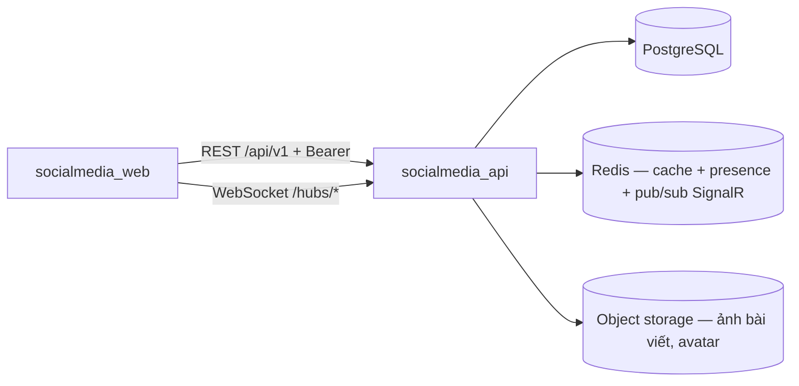

# SocialMedia — Kiến trúc hiện tại

> Nguồn sự thật cho agent. Tài liệu phân tích & thiết kế đầy đủ (PTTK HTTT): `docs/`.
> Cập nhật file này mỗi khi thêm/bỏ service, đổi ranh giới hoặc đổi hợp đồng giữa các service.

## 1. Hai subproject

| Thư mục | Vai trò | Stack | Cổng | Quản lý gói |
|---|---|---|---|---|
| `socialmedia_api` | Backend chính, sở hữu toàn bộ dữ liệu | ASP.NET Core (.NET 10), EF Core / PostgreSQL, Redis | 5000 | NuGet (dotnet) |
| `socialmedia_web` | Web app (người dùng cuối) | Next.js 15 App Router, React 19, Tailwind, TanStack Query 5 | 3000 | pnpm |

Điều phối bằng `Makefile` ở gốc (`make dev-api`, `make dev-web`, `make check`…).

## 2. Ranh giới & chiều gọi



Luật bất biến:

- **Chỉ `socialmedia_api` chạm PostgreSQL.** Web không bao giờ nói chuyện trực tiếp với DB.
- **Realtime (nhắn tin, thông báo) đi qua SignalR hub của API** — web không tự mở kết nối tới Redis hay dịch vụ nào khác.
- **Upload ảnh đi qua API**, API validate (≤ 10MB/ảnh, tối đa 10 ảnh/bài) rồi mới đẩy lên object storage. Web không upload thẳng lên storage.
- `X-Request-Id` do API sinh cho mỗi request → truy vết một thao tác xuyên log của API và hub.

## 3. Hợp đồng HTTP của `socialmedia_api`

- Prefix chung `/api`, URI versioning mặc định `v1` → mọi route là `/api/v1/<resource>`.
- `/api/health` là version-neutral (không có `/v1`).
- Swagger UI `/docs` **chỉ bật ở development**. Prod tắt để không lộ contract.
- Validate toàn cục bằng FluentValidation + model binding chặt: field không khai trong DTO sẽ bị **từ chối 400**, không phải bỏ qua.
- AuthN: JWT. **Mọi route mặc định cần Bearer token** (fallback policy `RequireAuthenticatedUser`); mở public bằng `[AllowAnonymous]`.
- AuthZ: RBAC qua policy/role (`User`, `Admin`).
- Access token đi ở header, refresh token là **cookie httpOnly** (`credentials: true` ở cả CORS lẫn axios).
- SignalR hubs mount tại `/hubs/chat`, `/hubs/notifications`, xác thực bằng cùng JWT (query `access_token` khi handshake).

## 4. Module nghiệp vụ (src/Modules)

`Auth` · `Users` (profile) · `Friendships` (kết bạn) · `Follows` (theo dõi) · `Posts` ·
`Comments` (trả lời 3 cấp) · `Reactions` (thả cảm xúc) · `Conversations` (nhắn tin) · `Notifications`

Ngoài nghiệp vụ: `Health` (`/api/health`, version-neutral).

Sơ đồ phụ thuộc chính:

```
Auth (User, RefreshToken)
 └─ Users (Profile)
     ├─ Friendships (FriendRequest, Friendship)
     ├─ Follows (Follow)
     ├─ Posts (Post, PostImage) ─┬─ Comments (Comment, parentId ≤ 3 cấp)
     │                           └─ Reactions (Reaction — đa hình: post/comment)
     ├─ Conversations (Conversation, Message) ─> hub /hubs/chat
     └─ Notifications (Notification) ─> hub /hubs/notifications
```

Quy ước dữ liệu:

- `Comment.parentId` tự tham chiếu, **giới hạn độ sâu 3** — API từ chối tạo reply cấp 4, không để client tự kiểm.
- `Reaction` dùng chung cho bài viết và bình luận (targetType + targetId), một user một reaction/target (unique index).
- Feed trang cá nhân và newsfeed đọc từ PostgreSQL, cache trang đầu bằng Redis.

## 5. Frontend (socialmedia_web)

- `app/` chỉ là routing + shell: mỗi `page.tsx` mount một *screen* nằm trong `features/`.
- Provider stack (`app/layout.tsx`): `AuthProvider` → `Providers` (QueryClient + Toast) → `SignalRProvider`.
- `lib/axios.ts` giữ **token bridge** và **single-flight refresh** khi gặp 401.
- Mỗi domain là một feature slice: `features/<name>/{api,components,hooks,lib,types,errors.ts,index.ts}`
  — `auth`, `profile`, `feed`, `post`, `comments`, `chat`, `friends`, `notifications`.

## 6. Triển khai

- Đóng gói bằng Docker (mỗi subproject một `Dockerfile`), deploy lên VPS qua **Dokploy**.
- PostgreSQL xem/quản trị bằng DBeaver; API thử bằng Swagger/Postman.
- Migration EF Core chạy lúc deploy (`dotnet ef database update` trong pipeline), không auto-migrate lúc app khởi động ở prod.

## 7. Nợ kỹ thuật đã biết

| Vấn đề | Chi tiết |
|---|---|
| (chưa có) | Cập nhật khi phát sinh: contract lệch giữa web/API, module có khung nhưng chưa bật, thư mục giữ chỗ rỗng… |
