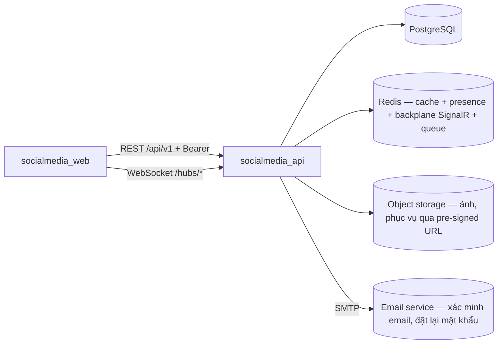

# SocialMedia — Kiến trúc hiện tại

> Nguồn sự thật cho agent về KIẾN TRÚC. Yêu cầu nghiệp vụ (use case, business rules BR-*,
> schema, phân quyền, acceptance criteria): `docs/SPEC.md` — kiến trúc mâu thuẫn với SPEC
> thì SPEC thắng. Cập nhật file này mỗi khi thêm/bỏ service, đổi ranh giới hoặc đổi hợp đồng.

## 1. Hai subproject

| Thư mục | Vai trò | Stack | Cổng | Quản lý gói |
|---|---|---|---|---|
| `socialmedia_api` | Backend chính, sở hữu toàn bộ dữ liệu | ASP.NET Core (.NET 10), EF Core / PostgreSQL, Redis | 5000 | NuGet (dotnet) |
| `socialmedia_web` | Web app (người dùng cuối) | Next.js 15 App Router, React 19, Tailwind, TanStack Query 5 | 3000 | pnpm |

Điều phối bằng `Makefile` ở gốc (`make dev-api`, `make dev-web`, `make check`…).

## 2. Ranh giới & chiều gọi



Luật bất biến:

- **Chỉ `socialmedia_api` chạm PostgreSQL.** Web không bao giờ nói chuyện trực tiếp với DB.
- **Realtime (nhắn tin, thông báo) đi qua SignalR hub của API** — web không tự mở kết nối tới Redis hay dịch vụ nào khác.
- **Upload ảnh đi qua API**: validate (≤ 10MB/ảnh, ≤ 10 ảnh/bài — BR-01, kiểm magic bytes) +
  **re-encode phía server bằng SixLabors.ImageSharp** rồi mới đẩy lên object storage; client đọc
  ảnh qua **pre-signed URL**. Web không upload thẳng lên storage.
- **Object storage: một adapter `AWSSDK.S3` cho cả hai môi trường** — local trỏ MinIO (docker
  compose), prod trỏ **Cloudflare R2**; khác nhau đúng `ServiceUrl` + credential
  (`ForcePathStyle = true` cả hai, R2 dùng `region = auto`).
- **Phân quyền default deny, RBAC động** (SPEC.md mục 4): permission code cố định trong code,
  role và `role_permissions` cấu hình được lúc chạy. Kiểm bằng `[HasPermission("...")]`, tập
  permission đọc từ **cache Redis** chứ không nhét vào JWT. Chống IDOR bằng kiểm
  ownership/membership ở tầng service (rủi ro Critical — TC-A03/A04 chạy trong CI).
- `X-Request-Id` do API sinh cho mỗi request → truy vết một thao tác xuyên log của API và hub.

## 3. Hợp đồng HTTP của `socialmedia_api`

- Prefix chung `/api`, URI versioning bằng **`Asp.Versioning.Mvc`**, mặc định `v1` → mọi route là `/api/v1/<resource>`.
- `/api/health` là version-neutral — gắn `[ApiVersionNeutral]`, không có `/v1`.
- Swagger UI `/docs` (**Swashbuckle.AspNetCore**, document sinh theo từng version qua `ApiExplorer`)
  **chỉ bật ở development**. Prod tắt để không lộ contract.
- Validate toàn cục bằng FluentValidation + model binding chặt: field không khai trong DTO sẽ bị **từ chối 400**, không phải bỏ qua.
- AuthN: JWT HS256, access TTL 15 phút, claims `sub`/`role`/`jti`. **Mọi route mặc định cần
  Bearer token** (fallback policy `RequireAuthenticatedUser`); mở public bằng `[AllowAnonymous]`.
- Refresh token: **cookie httpOnly** (`credentials: true` ở cả CORS lẫn axios), lưu **băm** trong DB,
  xoay vòng mỗi lần dùng; phát hiện reuse → thu hồi cả chuỗi phiên.
- Đăng nhập có **xác minh email** (chưa xác minh → 403) và **lockout** (sai 5 lần/15 phút → 423) — SPEC.md US-002.
  Quên mật khẩu (UC-21) dùng chung bảng `auth_tokens` với xác minh email, phân biệt bằng cột `purpose`.
- AuthZ: **RBAC động** — 3 role seed sẵn `User` / `Moderator` / `Admin` nhưng tạo/sửa được lúc chạy;
  **1 user = 1 role**; quyền kiểm bằng permission code, không bằng tên role. Claim `role` trong JWT
  chỉ để frontend render menu. Cộng thêm kiểm quyền theo resource trong service.
- SignalR hubs mount tại `/hubs/chat`, `/hubs/notifications`, xác thực bằng cùng JWT (query `access_token` khi handshake).

## 4. Module nghiệp vụ (src/Modules)

`Auth` · `Users` (profile + tìm kiếm) · `Friendships` (kết bạn) · `Follows` (theo dõi) · `Posts` ·
`Comments` (trả lời ≤ 3 cấp) · `Reactions` (thả cảm xúc) · `Conversations` (nhắn tin 1-1) ·
`Notifications` · `Moderation` (báo cáo + kiểm duyệt + audit log) · `Admin` (khóa tài khoản, gán vai trò)

Ngoài nghiệp vụ: `Health` (`/api/health`, version-neutral).

Sơ đồ phụ thuộc chính (entity theo SPEC.md mục 3):

```
Auth (User, RefreshToken, AuthToken, Role, Permission, RolePermission)
 └─ Users (Profile)
     ├─ Friendships (Friendship — cặp user_min < user_max)
     ├─ Follows (Follow)
     ├─ Posts (Post, MediaAttachment) ─┬─ Comments (Comment, parentId ≤ 3 cấp)
     │                                 └─ Reactions (Reaction — đa hình: post/comment)
     ├─ Conversations (Conversation, Message) ─> hub /hubs/chat
     ├─ Notifications (Notification) ─> hub /hubs/notifications
     └─ Moderation (Report, AuditLog) ─> Posts/Comments (post.hide — BR-07)
Admin ─> Users (lock/unlock), Auth (role.assign, role.manage), Moderation (audit.read)
```

`Admin` sở hữu nghiệp vụ quản lý role + `role_permissions` (RBAC động); hạ tầng kiểm quyền
(`[HasPermission]`, policy provider, cache Redis) nằm ở `Common` vì nó không biết nghiệp vụ.

Quy ước dữ liệu (chi tiết cột/constraint: SPEC.md mục 3):

- Bài viết: `privacy` **3 mức** `public / friends / private` (BR-02, đánh giá tại thời điểm đọc)
  + `status` `published / hidden / deleted` (BR-07 — kiểm duyệt gỡ bài là chuyển `hidden`,
  tác giả vẫn thấy kèm lý do).
- `Comment.parentId` tự tham chiếu, **giới hạn độ sâu 3** (BR-08) — API từ chối reply cấp 4;
  xóa comment giữ nhánh trả lời, hiển thị "Bình luận đã bị xóa".
- `Reaction` đa hình (targetType + targetId), PK `(user, target_type, target_id)` — một user
  một cảm xúc/target, thả loại khác là thay thế (BR-05).
- `Friendship` identity là cặp `(user_min, user_max)` với CHECK `user_min < user_max` (BR-03);
  mỗi cặp tối đa 1 hội thoại (`UQ(user_a, user_b)`, CK `a < b`).
- Nhắn tin: chỉ bạn bè (BR-06/BR-09 — hủy kết bạn thì hội thoại **chỉ đọc**); `Message` có
  `seq` tăng đơn điệu trong hội thoại (UQ) + `client_msg_id` idempotency (UQ) + trạng thái
  Sent/Delivered/Seen.
- **Ngoại lệ counter có chủ đích**: `Post.comment_count` + `reaction_counts` (jsonb) là bộ đếm
  phi chuẩn hóa — cập nhật cùng transaction với bản ghi thật, job đêm đối soát (SPEC.md 3.5/3.7).
  Ngoài hai bộ đếm này, không lưu trạng thái suy được từ dữ liệu khác.
- Feed đọc từ PostgreSQL (fan-out-on-read), cache Redis 30s trang đầu; kiểm tra quan hệ bạn bè
  cache TTL 60s.
- Seed `roles`, `reason_code` bằng migration idempotent; admin đầu tiên qua biến môi trường.

## 5. Frontend (socialmedia_web)

- `app/` chỉ là routing + shell: mỗi `page.tsx` mount một *screen* nằm trong `features/`.
- Provider stack (`app/layout.tsx`): `AuthProvider` → `Providers` (QueryClient + Toast) → `SignalRProvider`.
- `lib/axios.ts` giữ **token bridge** và **single-flight refresh** khi gặp 401.
- Mỗi domain là một feature slice: `features/<name>/{api,components,hooks,lib,types,errors.ts,index.ts}`
  — `auth`, `profile`, `feed`, `post`, `comments`, `chat`, `friends`, `notifications`,
  `moderation` (màn hình Moderator/Admin).

## 6. Triển khai

- Đóng gói bằng Docker (mỗi subproject một `Dockerfile`), deploy lên VPS qua **Dokploy**.
- **Một** solution `socialmedia_api/SocialMedia.sln` (src + tests). Web không có `.sln` —
  `package.json` đóng vai trò đó; `.sln` là khái niệm của MSBuild, không gom được project Node.
- PostgreSQL **16.15** (pin cả minor, local và prod như nhau) xem/quản trị bằng DBeaver;
  API thử bằng Swagger/Postman.
- **Hạ tầng local chỉ đến từ `docker compose`** — không cài trực tiếp lên máy. Máy nào đã có
  PostgreSQL sẵn (kể cả **trong WSL**) phải tắt hẳn service đó: Windows không thấy socket của WSL
  trong netstat nên container vẫn bind 5432 thành công, sau đó `localhost:5432` từ Windows và từ
  trong WSL trỏ về hai DB khác nhau mà không báo lỗi gì.
- Object storage: **MinIO** ở local, **Cloudflare R2** ở prod (không chạy MinIO trên VPS).
- Migration EF Core chạy lúc deploy (`dotnet ef database update` trong pipeline), không
  auto-migrate lúc app khởi động ở prod; migration backward-compatible 1 phiên bản (expand–contract).
- `dotnet-ef` là **local tool** khai trong `dotnet-tools.json`, không cài global.

## 7. Nợ kỹ thuật đã biết

| Vấn đề | Chi tiết |
|---|---|
| Gửi email đồng bộ ở bước 1.2 | Đăng ký/quên mật khẩu gửi mail ngay trong request. Trả nợ ở **ROADMAP 5.3** khi `Infra/Queue` đã có — trạng thái đích là api.md mục 7/8. |
| Avatar lưu local ở bước 1.4 | `profiles.avatar_key` tạm trỏ thư mục local. Trả nợ ở **ROADMAP 3.1** khi `StorageService` xong; schema không đổi, chỉ đổi cách dựng URL. |
| Xóa cứng 90 ngày + ẩn danh PII 30 ngày | SPEC.md 3.7. ROADMAP **6.5** đã cover đối soát bộ đếm, dọn media mồ côi và `auth_tokens` hết hạn; hai job vòng đời dữ liệu này chỉ làm nếu còn thời gian. |
| Cache quyền có thể lệch nếu xoá cache lỗi | RBAC động đọc permission từ Redis (TTL 300s). Nếu bước xoá cache sau khi đổi `role_permissions` thất bại, quyền cũ còn hiệu lực tới 300s. Chấp nhận ở quy mô đồ án; TC-A08 kiểm đường thành công. |
| UC-14 chặn người dùng | Ngoài phạm vi, thay bằng BR-09 (hủy kết bạn → hội thoại chỉ đọc). |
| Lệch báo cáo có chủ đích | RBAC động thay ma trận cố định, UC-21, AC-04 hạ còn 100–200 VU. Báo cáo cập nhật theo sản phẩm ở cuối kỳ — xem đầu `docs/SPEC.md`. |
